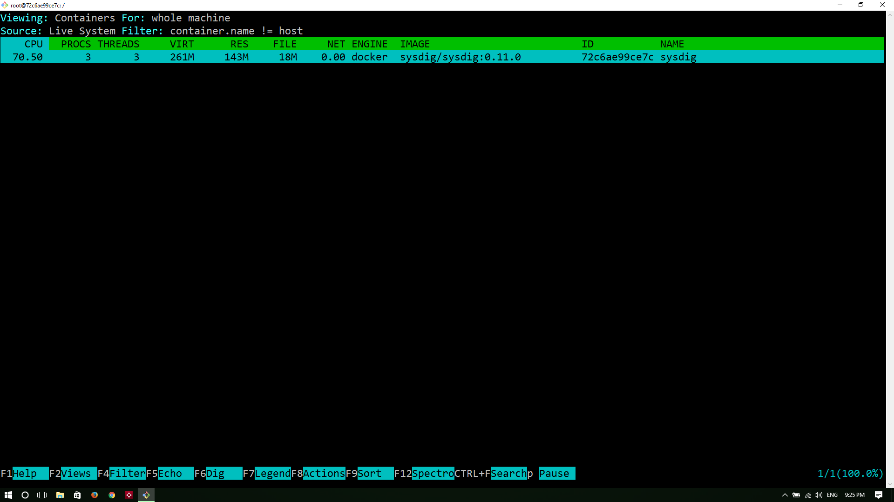

# Managing Containers - Learning about Common Container Operations

In the previous chapter, we have learnt about container lifecycle management including how to create, launch, connect to, stop and remove containers. In this chapter, we are going to learn how to launch a container with a pre built app image and how to access the app with published ports. We will also learn about common container operations such as inspecting container information, checking logs and performance stats, renaming and updating the properties of a container, limiting resources etc.  

As part of this lab, we are going to launch a python based webapp for a sample voting application.    

### Launching a container with a pre built app image  

To launch vote container run the following command. Don't bother about the new flag **-P** now. We will explain about that flag later in this chapter  
```
docker container run  -idt -P  schoolofdevops/vote
```  
[Output]  

```
Unable to find image 'schoolofdevops/vote:latest' locally
latest: Pulling from schoolofdevops/vote
Digest: sha256:9195942ea654fa8d8aeb37900be5619215c08e7e1bef0b7dfe4c04a9cc20a8c2
Status: Downloaded newer image for schoolofdevops/vote:latest
7d58ecc05754b5fd192c4ecceae334ac22565684c6923ea332bff5c88e3fca2b
```
Lets check the status of the container  
```
docker ps -l
```  
[Output]  

```
CONTAINER ID        IMAGE                 COMMAND                  CREATED             STATUS              PORTS                   NAMES
7d58ecc05754        schoolofdevops/vote   "gunicorn app:app -b…"   27 seconds ago      Up 26 seconds       0.0.0.0:32768->80/tcp   peaceful_varahamihira
```  

### Renaming the container  
We can rename the container by using following command  
```
docker rename 7d58ecc05754 vote
```  
[replace 7d58ecc05754 with the actual container id on your system ]

We have changed container's automatically generated name to **vote**. This new name can be of your choice. The point to understand is this command takes two arguments. The **Old_name followed by New_name**
Run docker ps command to check the effect of changes  
```
docker ps
```  
[Output]  

```
CONTAINER ID        IMAGE                 COMMAND                  CREATED             STATUS              PORTS                   NAMES
7d58ecc05754        schoolofdevops/vote   "gunicorn app:app -b…"   3 minutes ago       Up 3 minutes        0.0.0.0:32768->80/tcp   vote
```

As you can see here, the container is renamed to **vote**. This makes referencing container in cli very much easier.  

### Ready to  vote ?  
Let's see what this **vote** application does by connecting to that application. For that we need,  
  * Host machine's IP  
  * Container's port which is mapped to a host's port

Let's find out the port mapping of container to host. Docker provides subcommand called **port** which does this job  

```
docker port vote  
```  
[Output]  

```
80/tcp -> 0.0.0.0:32768
```  
So whatever traffic the host gets in port **2368** will be mapped to container's port **32768**  

Let's connect to http://IP_ADDRESS:PORT to see the actual application  


### Finding Everything about the running  container
This topic discusses about finding metadata of containers. These metadata include various parameters like,  
  * State of the container  
  * Mounts  
  * Configuration  
  * Network, etc.,  

#### Inspecting
Lets try this inspect subcommand in action  

```
docker inspect vote
```  

Data output by above command contains detailed descriptino of the container an its properties. is represented in JSON format which makes filtering these results easier.  

#### Checking the Stats  

##### Stats command  
This command returns a data stream of resource utilization used by containers. The flag **--no-stream** disables data stream and displays only first result  

```
docker stats --no-stream=true vote

docker stats
```  


##### Top command  
To display the list of processes and the information about those processes that are running inside the container, we can use **top** command

```
docker top vote
```  

[Output]  

```
UID                 PID                 PPID                C                   STIME               TTY                 TIME                CMD
vagrant             6219                6211                0                   14:07               ?                   00:00:00            npm
vagrant             6275                6219                0                   14:07               ?                   00:00:00            sh -c node index
vagrant             6276                6275                0                   14:07               ?                   00:00:11            node index

```

### Examine Logs  
Docker **log** command is to print the logs of the application inside the container. In our case we will see the log output of vote application  

```
docker logs vote
```  

[Output]  

```
[2018-05-01 15:36:01 +0000] [1] [INFO] Starting gunicorn 19.6.0
[2018-05-01 15:36:01 +0000] [1] [INFO] Listening at: http://0.0.0.0:80 (1)
[2018-05-01 15:36:01 +0000] [1] [INFO] Using worker: sync
[2018-05-01 15:36:01 +0000] [10] [INFO] Booting worker with pid: 10
[2018-05-01 15:36:01 +0000] [11] [INFO] Booting worker with pid: 11
[2018-05-01 15:36:01 +0000] [12] [INFO] Booting worker with pid: 12
[2018-05-01 15:36:01 +0000] [15] [INFO] Booting worker with pid: 15```  

If you want to **follow** the log in real-time, use **-f** flag  

```

To follow the logs,

```
docker logs -f vote
```  

Now try to read the articles available in our blog and see the log output gets updated in real-time. Hit **ctrl+c** to break the stream  

### Stream events from the docker daemon   
Docker **events** serves us with the stream of events or interactions that are happening with the docker daemon. This does not stream the log data of application inside the container. That is done by **docker logs** command. Let us see how this command works  
Open an another terminal. Let us call the old terminal as **Terminal 1** and the newer one as **Terminal 2**.

From Terminal 1, execute **docker events**. Now you are getting the data stream from docker daemon  

```
docker events
```  

To understand how this command actually works, let us run a container from Terminal 2  

```
docker run -it alpine:3.4 sh  
```  

If you see, in Terminal 1, the interaction with docker daemon, while running that container will be printed  

[Output - **Terminal 1**]  

```
2016-09-16T13:00:20.189028004Z container create 816fcc5e9c8dca13c76f3ff4546a7769bed497c4f4153b20ec34459c88f7b923 (image=alpine:3.4, name=tiny_franklin)
2016-09-16T13:00:20.190190470Z container attach 816fcc5e9c8dca13c76f3ff4546a7769bed497c4f4153b20ec34459c88f7b923 (image=alpine:3.4, name=tiny_franklin)
2016-09-16T13:00:20.257068692Z network connect c0237b5406920749b87460597b8935adf958bae1ce997afd827921a0dbc97cdc (container=816fcc5e9c8dca13c76f3ff4546a7769bed497c4f4153b20ec34459c88f7b923, name=bridge, type=bridge)
2016-09-16T13:00:20.346533821Z container start 816fcc5e9c8dca13c76f3ff4546a7769bed497c4f4153b20ec34459c88f7b923 (image=alpine:3.4, name=tiny_franklin)
2016-09-16T13:00:20.347811877Z container resize 816fcc5e9c8dca13c76f3ff4546a7769bed497c4f4153b20ec34459c88f7b923 (height=41, image=alpine:3.4, name=tiny_franklin, width=126)
```  

Try to do various docker operations (start, stop, rm, etc.,) and see the output in Terminal 1  

### Attach to the container  
Normally, when we run a container, we use **-d** flag to run that container in detached mode. But sometimes you might require to make some changes inside that container. In those kind of situations, we can use **attach** command. This command attaches to the tty of docker container. So it will stream the output of the application. In our case, we will see the output of vote application  

```
docker attach vote
```  
Hit our blogs url several times to see the output  

[Output]  

```
root@swarm-03:~# docker attach vote
[2018-05-01 15:44:49 +0000] [1] [INFO] Handling signal: winch

```  

You can detach from the tty by pressing **ctrl-p + ctrl-q** in sequence. If you haven't started your container with **-it** flag, then it is not possible to get your host's terminal back. In that case, If you haven't started the container with **-it** option, the only way you will be able to detach  from the container by using **ctrl-c**, which kills the process, in turns the container itself.   

It is possible to override these keys too. For that we have to add --detach-keys flag to the command. To learn more, click on the following URL  

https://docs.docker.com/engine/reference/commandline/attach/  

### Copying files between container and client host  

We can copy files/directories form host to container and vice-versa    
Let us create a file on the host  
```
touch testfile
```  

To copy the testfile **from host machine to ghsot contanier**, try  
```
docker cp testfile vote:/opt  
```  
This command will copy testfile to vote container's **/opt** directory  and will not give any output. To verify the file has been copies or not, let us log into container by running,  

```
docker exec -it vote bash
```  
Change directory into /opt and list the files  

```
cd /opt  
ls
```  

[Output]  

```
testfile
```  

There you can see that file has been successfully copied. Now exit the container  

Now you may try to cp some files **from the container to the host machine**  

```
docker cp vote:/app  .  
ls  
```  

### Controlling Resources  
Docker provides us the granularity to control each container's **resource utilization**. We have several commands in the inventory to achieve this  

#### Putting limits on Running Containers  
First, let us monitor the utilization

```
docker stats --no-stream=true
```  

[Example Output]  

```
"docker stats --no-stream=true
CONTAINER ID        NAME                                CPU %               MEM USAGE / LIMIT     MEM %               NET I/O             BLOCK I/O           PIDS
7d58ecc05754        vote                                0.02%               56.5MiB / 1.955GiB    2.82%               648B / 0B           0B / 0B             0
9fc1aec8cb6a        gallant_brattain                    0.00%               328KiB / 1.955GiB     0.02%               690B / 0B           0B / 0B             0
08f0242aa61c        vote.2.qwxduexkwpmdnowouxjzwjwag    0.02%               56.33MiB / 1.955GiB   2.81%               1.94kB / 0B         0B / 0B             0
8469b95efc81        redis.4.s5i3kid9yohpbim05bsw59sh2   0.12%               6.223MiB / 1.955GiB   0.31%               1.36kB / 0B         0B / 0B             0
ce823d38adaf        redis.1.qfx6geh6t9vuy8awq94u10m07   0.08%               6.227MiB / 1.955GiB   0.31%               7.25kB / 5.39kB     0B / 0B             0
```  

For monitoring resources continuously,

```
docker stats --no-stream=true
```  
You can see that **Memory** attribute has **0** as its value. 0 means unlimited usage of host's RAM. We can put a cap on that by using **update** command  

```
docker update --memory 400M --memory-swap -1 vote   
```  

[Output]  

```
vote
```  
Let us check whether the change has taken effect or not  

```
docker inspect vote | grep -i memory
docker stat 
```  

[Output]  

```
"Memory": 419430400,
"KernelMemory": 0,
"MemoryReservation": 0,
"MemorySwap": 0,
"MemorySwappiness": -1,

```  
As you can see, the memory utilization of the container is changed from 0 (unlimited) to 400 mb  

#### Limiting Resources while launching new containers  
The following resources can be limited using the *update* command  
  * CPU
  * Memory
  * Disk IO
  * Capabilities  

Open two terminals, lets call them T1, and T2  
In T1, start monitoring the stats  

```
docker stats
```  

[Output]  
```
CONTAINER           CPU %               MEM USAGE / LIMIT     MM %               NET I/O             BLOCK I/O             PIDS
b28efeef41f8        0.16%               190.1 MiB / 400 MiB   47.51%              1.296 kB / 648 B    86.02 kB / 45.06 kB   0
CONTAINER           CPU %               MEM USAGE / LIMIT     MEM %               NET I/O             BLOCK I/O             PIDS
b28efeef41f8        0.01%               190.1 MiB / 400 MiB   47.51%              1.296 kB / 648 B    86.02 kB / 45.06 kB   0
```

From T2, launch two containers with different CPU shares. Default CPU shares are set to 1024. This is a relative weight.  

```
docker run -d --name st-01  schoolofdevops/stresstest stress --cpu 1

docker run -d --name st-02 -c 512  schoolofdevops/stresstest stress --cpu 1

```  
When you launch the first container, it will use the full quota of CPU, i.e., 100%  

[Output - **After first container launch**]  

```
CONTAINER           CPU %               MEM USAGE / LIMIT       MEM %               NET I/O             BLOCK I/O             PIDS
b28efeef41f8        0.01%               190.1 MiB / 400 MiB     47.51%              1.944 kB / 648 B    86.02 kB / 45.06 kB   0
764f158d6523        102.73%             2.945 MiB / 1.797 GiB   0.16%               648 B / 648 B       3.118 MB / 0 B        0
```  

[Output - **After second container lauch**]  

```
CONTAINER           CPU %               MEM USAGE / LIMIT       MEM %               NET I/O             BLOCK I/O             PIDS
b28efeef41f8        0.00%               190.1 MiB / 400 MiB     47.51%              2.592 kB / 648 B    86.02 kB / 45.06 kB   0
764f158d6523        66.97%              2.945 MiB / 1.797 GiB   0.16%               1.296 kB / 648 B    3.118 MB / 0 B        0
a13f98995ade        33.36%              2.945 MiB / 1.797 GiB   0.16%               648 B / 648 B       3.118 MB / 0 B        0
```  

Observe stats in T1
Launch a couple more nodes with different cpu shares, observe how T2 stats change  

```
docker run -d --name st-03 -c 512  schoolofdevops/stresstest stress --cpu 1

docker run -d --name st-04  schoolofdevops/stresstest stress --cpu 1

```  

[Output - **After all containers are launched**]  

```
CONTAINER           CPU %               MEM USAGE / LIMIT       MEM %               NET I/O             BLOCK I/O             PIDS
b28efeef41f8        0.00%               190.1 MiB / 400 MiB     47.51%              3.888 kB / 648 B    86.02 kB / 45.06 kB   0
764f158d6523        32.09%              2.945 MiB / 1.797 GiB   0.16%               2.592 kB / 648 B    3.118 MB / 0 B        0
a13f98995ade        16.02%              2.945 MiB / 1.797 GiB   0.16%               1.944 kB / 648 B    3.118 MB / 0 B        0
f04e9ea5627c        16.37%              2.949 MiB / 1.797 GiB   0.16%               1.296 kB / 648 B    3.118 MB / 0 B        0
abeab389a873        31.71%              2.949 MiB / 1.797 GiB   0.16%               648 B / 648 B       3.118 MB / 0 B        0
```  
Close the T2 terminal  

#### Exercises  
Try to these exercises, to get a better understanding  
  * Put a memory limit
  * Set disk iops

### Launching Containers with Elevated  Privileges  
When the operator executes docker run --privileged, Docker will enable to access to all devices on the host as well as set some configuration in AppArmor or SELinux to allow the container nearly all the same access to the host as processes running outside containers on the host.

#### Example:  
##### Running a sysdig container to monitor docker  
Sysdig tool allows us to monitor the processes that are going on in the other containers. It is more like running a top command from one container on behalf of others.  

```
docker run -itd --name=sysdig --privileged=true \
           --volume=/var/run/docker.sock:/host/var/run/docker.sock \
           --volume=/dev:/host/dev \
           --volume=/proc:/host/proc:ro \
           --volume=/boot:/host/boot:ro \
           --volume=/lib/modules:/host/lib/modules:ro \
           --volume=/usr:/host/usr:ro \
           sysdig/sysdig:0.11.0 sysdig
```  
[Output]  
```
Unable to find image 'sysdig/sysdig:0.11.0' locally
0.11.0: Pulling from sysdig/sysdig

0f409b0f5b3d: Pull complete
64965da77fc6: Pull complete
588eeb0d4c30: Pull complete
9aa18e35b362: Pull complete
cc036f2dca14: Pull complete
33400f3af946: Pull complete
b39ed90e36fd: Pull complete
1fca16436380: Pull complete
Digest: sha256:ee9d66a07308c5aef91f070cce5c9fb891e4fefb5da4d417e590662e34846664
Status: Downloaded newer image for sysdig/sysdig:0.11.0
6ba17cf2af7b87621b3380517af45c5785dc8cda75111f0f8c36bb83e163a120
```

```
docker exec -it sysdig bash
csysdig
```  

[Output]  

  

After this, press f2 and select **containers** tab  
Now check what are the processes are running in other containers  

  


##### References

[Resource Management in Docker by Marek Goldmann] (https://goldmann.pl/blog/2014/09/11/resource-management-in-docker/)
